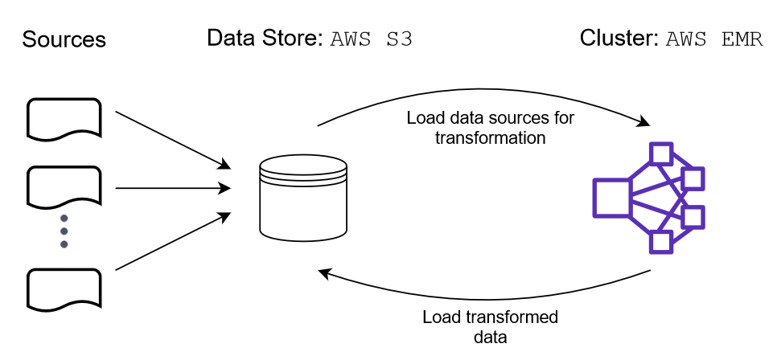

# Data Pipeline to Transform I94 Immigration Data with PySpark on AWS EMR

## Objective

The US National Tourism and Trade Office gather data from visitors to the US from all over the world. The objective of this project is to combine this data with statistics of temperature of the country of origin and demographics of state where the traveler visited. This enhancement allows to better understand the incoming travellers to the US. Ultimately, we want to automate this process through a ETL pipeline orchestrated with **Airflow**. A file storage in S3, to easy access and analysis, is the expected product of this data pipeline.

## Overview

The scope is to improve gather and combine information related to visitors to the US starting off the I94 immigration data. The output is an analytic table that can be used by data analytics from the government, marketing or other businessess. This table contains information related to the country of origin of the visitors as well as information about the location where the visitor arrived in the US.

The principal issue with the I94 immigration data is that the information is stored as code like for example US states, occupation and dates. This makes the data not explicit for all type of users. Also this dataset lacks of context information that we are aim to add. Given the large of amount we take advantage of PySpark running in a Elastic MapReduce (EMR) cluster to do the data transformations. Moreover, this process is automated throught Airflow to perform each one of the tasks in order.

## Implementation

### ETL

We are dealing with large amount of data and we have the need to transform it to allow further analysis. This pipeline is intended to run it annually or semi-annually.  Below is explained this process.

##### Sources
We have four sources of data that are stored in a AWS S3 bucket: 
- I94 Immigration Data: US National Tourism and Trade Office data of visitors. Source: [I-94 Record](https://travel.trade.gov/research/reports/i94/historical/2016.html)
- World Temperature Data: Information of temperature by city. Source: [Kaggle](https://www.kaggle.com/berkeleyearth/climate-change-earth-surface-temperature-data)
- U.S. City Demographic Data: Demographic statistics by state of the U.S. Source: [Opensoft](https://public.opendatasoft.com/explore/dataset/us-cities-demographics/export/)
- Airport Code Table: Airport codes and corresponding cities. Source: [DataHub](https://datahub.io/core/airport-codes#data)

##### Extraction

The sources are loaded to a S3 bucket in order that the EMR cluster can access the data with PySpark

##### Transformation

Once the data is loaded in a PySpark dataframe the following transformation are performed

1. **Date columns cast type**: The columns with the arrival and departure date, from immigration data, were transformed from SAS date numeric field to datetime

2. **Add demographic data**: Using the column `i94addr` from the immigration data we join the demographic data. This information is avaible at the city level but the immigration data only have information of the visitors at state level. Thus, this information was aggregated to state level in order to combined it with immigration data.

3. **Add airport data**: As a preliminary step to join the temperature data we map the city of origin from airport code

4. **Add temperature data**: With the city origin we can get the temperature by airport and arrival date

##### Load

The resulting dataframe was loaded into a S3 bucket in order to long-term storage.

A diagram of the process is below:

## Data Pipeline

The ETL pipeline was orchestrated by defining a directed acyclic graph (DAG) on Airflow with the following nodes/tasks:

- load_files: Subdag that uploads files to S3. It has the following task:
    - load_transform_script: Loads `transform.py` script that do the transformation to data
    - load_quality_script:  Loads `quality.py` script that do the data quality check of the transformed data
    - load_airport_data: Loads csv file with information related to airports
    - load_temperature_data: Loads csv file with information related to city temperatures
    - load_demographic_data: Loads csv file with information related to us states demographics

- create_emr_cluster: Creates a cluster in AWS EMR

- add_steps: Add procedure to submit to spark the python script

- watch_step: Add a listener of the state of procedure on the cluster

- terminate_emr_cluster: Terminates the cluster in AWS EMR

The DAG is shown below:

### Files

- `docker-compose.yml`: Defines docker container of Airflow

- `dags/transform_dag.py`: Specifies the DAG of the data pipeline

- `dags/load_subdag.py`: Specifies the 'load_files_subdag' which is part of the 'transform' dag

- `plugins/operators/move.py`: Defines an operator to load data to S3

- `plugins/operators/quality.py`: Defines an operator to check data quality

- `plugins/helpers/configurations.py`: Stores configuration and step to add to start the EMR cluster

- `airflow/plugins/operators/data_quality.py`: Defines an operator to check data quality

- `dags/data`: Directory that contains the data to upload to S3

- `dags/scripts`: Directory that contains scripts to upload to S3 and run on EMR

- `explore.ipynb`: IPython notebook that contains examples of queries with the transformed data

- `data_dictionary.xlsx`: Excel file with meta data of the table with the transformed data

## Instructions

On the terminal on the working directory do the following:

1. Download data from https://drive.google.com/drive/folders/1bM4lJhssSqo8DGhv3cVBBbkWYhIvv-JO?usp=sharing and store it in `dags/data` directory.

2. Upload I94 Immigration data to S3 bucket

3. Set the name of the S3 bucket in `dags/transform_dag.py`

4. Add your *Aws Access Key* and *Aws Secret Key* to `dags/scripts/transform.py` file.

5. Run `docker-compose up`

6. On the web browser go to `localhost:8080`

7. Unpause *transform* DAG

8. Once the DAG was completed you can run query examples in `explore.ipynb`

## Discussion

**Data increases by 100x**

This data pipeline deals with a large amount of data under 10 minutes. If it is the case that the data increases by 100x can be change the cluster creation configuration in order to increase the memory in order to perform the transformations.

**Pipeline must run on a daily basis by 7am**

Given the nature of the data this data pipeline was designed to be runned yearly. If it is the case that the pipeline must run every day then the configuration of the DAG should be change. The `schedule_interval` should be `@daily` and the `start_date` should be at an hour before 7 am. 

**Database needed to be accessed by 100+ people.**

This data pipeline stores the transformed data in a S3 bucket where can be accessed by any person. There is no problem that 100+ need to access it.

## References

- [Solving 5 Mysterious Spark Errors](https://medium.com/@yhoso/resolving-weird-spark-errors-f34324943e1c#ca65#3604)

- [How to submit Spark jobs to EMR cluster from Airflow](https://www.startdataengineering.com/post/how-to-submit-spark-jobs-to-emr-cluster-from-airflow/)

